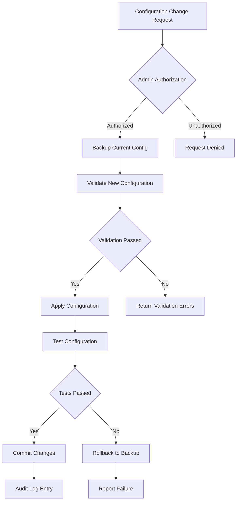

# 🛡️ Veridity Admin Flows

Comprehensive administrative workflow documentation for the Veridity privacy-first identity platform.

## 🎯 Overview

This document outlines all administrative workflows within the Veridity platform, from user management to system monitoring and security incident response.

## 👨‍💼 Admin User Types & Roles

### Role Hierarchy
```typescript
interface AdminRole {
  id: string;
  name: string;
  permissions: Permission[];
  level: 'super_admin' | 'admin' | 'moderator' | 'analyst';
  regions?: string[];
  canDelegate?: boolean;
}

interface Permission {
  resource: 'users' | 'system' | 'analytics' | 'security' | 'integrations';
  actions: ('create' | 'read' | 'update' | 'delete' | 'execute')[];
  constraints?: {
    timeWindow?: string;
    approvalRequired?: boolean;
    logRequired?: boolean;
  };
}

const adminRoles: AdminRole[] = [
  {
    id: 'super_admin',
    name: 'Super Administrator',
    permissions: [
      {
        resource: 'users',
        actions: ['create', 'read', 'update', 'delete'],
        constraints: { logRequired: true }
      },
      {
        resource: 'system',
        actions: ['create', 'read', 'update', 'delete', 'execute'],
        constraints: { approvalRequired: true, logRequired: true }
      }
    ],
    level: 'super_admin',
    canDelegate: true
  },
  {
    id: 'regional_admin',
    name: 'Regional Administrator',
    permissions: [
      {
        resource: 'users',
        actions: ['read', 'update'],
        constraints: { logRequired: true }
      }
    ],
    level: 'admin',
    regions: ['Province-1', 'Bagmati', 'Gandaki'],
    canDelegate: false
  }
];
```

## 🔐 Admin Authentication Flow


### Authentication Implementation
```typescript
interface AdminAuthRequest {
  username: string;
  password: string;
  mfaToken: string;
  clientInfo: {
    ip: string;
    userAgent: string;
    deviceFingerprint: string;
  };
}

interface AdminSession {
  sessionId: string;
  adminId: string;
  role: AdminRole;
  permissions: Permission[];
  expiresAt: Date;
  lastActivity: Date;
  restrictions: SessionRestriction[];
}

interface SessionRestriction {
  type: 'ip_whitelist' | 'time_window' | 'action_limit';
  value: string;
  enforced: boolean;
}

class AdminAuthenticationService {
  async authenticateAdmin(request: AdminAuthRequest): Promise<AdminSession | null> {
    try {
      // Step 1: Basic credential validation
      const adminUser = await this.validateCredentials(request.username, request.password);
      if (!adminUser) {
        await this.logFailedAttempt(request);
        return null;
      }

      // Step 2: Multi-factor authentication
      const mfaValid = await this.validateMFA(adminUser.id, request.mfaToken);
      if (!mfaValid) {
        await this.logFailedAttempt(request);
        return null;
      }

      // Step 3: Security checks
      const securityPassed = await this.performSecurityChecks(request.clientInfo);
      if (!securityPassed) {
        await this.logSuspiciousActivity(request);
        return null;
      }

      // Step 4: Create secure session
      const session = await this.createAdminSession(adminUser);

      await this.logSuccessfulLogin(adminUser.id, request.clientInfo);
      return session;

    } catch (error) {
      await this.logAuthError(error, request);
      return null;
    }
  }

  private async performSecurityChecks(clientInfo: any): Promise<boolean> {
    // Rate limiting
    const rateLimitPassed = await this.checkRateLimit(clientInfo.ip);

    // Device fingerprinting
    const deviceTrusted = await this.checkDeviceTrust(clientInfo.deviceFingerprint);

    // Geo-location verification
    const locationValid = await this.verifyLocation(clientInfo.ip);

    return rateLimitPassed && deviceTrusted && locationValid;
  }
}
```

## 📊 Admin Dashboard Workflows

### 1. Real-time System Monitoring


```typescript
interface SystemMetrics {
  timestamp: Date;
  activeUsers: number;
  proofGenerations: {
    total: number;
    successful: number;
    failed: number;
    averageTime: number;
  };
  apiHealth: {
    governmentAPIs: APIHealthStatus[];
    responseTime: number;
    errorRate: number;
  };
  security: {
    suspiciousActivities: number;
    blockedIPs: string[];
    failedLogins: number;
  };
  performance: {
    cpuUsage: number;
    memoryUsage: number;
    diskUsage: number;
    networkLatency: number;
  };
}

interface APIHealthStatus {
  name: string;
  endpoint: string;
  status: 'healthy' | 'degraded' | 'down';
  responseTime: number;
  errorRate: number;
  lastChecked: Date;
}

const AdminDashboard = () => {
  const [metrics, setMetrics] = useState<SystemMetrics | null>(null);
  const [alerts, setAlerts] = useState<Alert[]>([]);
  const { adminSession } = useAdminAuth();

  useEffect(() => {
    const fetchMetrics = async () => {
      try {
        const data = await adminAPI.getSystemMetrics();
        setMetrics(data);

        // Check for alert conditions
        const newAlerts = checkAlertConditions(data);
        if (newAlerts.length > 0) {
          setAlerts(prev => [...prev, ...newAlerts]);
        }
      } catch (error) {
        console.error('Failed to fetch metrics:', error);
      }
    };

    // Initial fetch
    fetchMetrics();

    // Real-time updates every 30 seconds
    const interval = setInterval(fetchMetrics, 30000);

    return () => clearInterval(interval);
  }, []);

  const checkAlertConditions = (data: SystemMetrics): Alert[] => {
    const alerts: Alert[] = [];

    if (data.proofGenerations.failed / data.proofGenerations.total > 0.05) {
      alerts.push({
        level: 'warning',
        message: 'High proof generation failure rate detected',
        timestamp: new Date(),
        action: 'investigate_proof_failures'
      });
    }

    if (data.performance.cpuUsage > 80) {
      alerts.push({
        level: 'critical',
        message: 'CPU usage critically high',
        timestamp: new Date(),
        action: 'scale_resources'
      });
    }

    return alerts;
  };

  return (
    <div className="admin-dashboard">
      <DashboardHeader adminSession={adminSession} />

      <div className="metrics-grid">
        <SystemHealthCard metrics={metrics} />
        <UserActivityCard metrics={metrics} />
        <ProofStatsCard metrics={metrics} />
        <SecurityAlertsCard alerts={alerts} />
      </div>

      <div className="real-time-charts">
        <ProofGenerationChart data={metrics?.proofGenerations} />
        <APIHealthChart data={metrics?.apiHealth} />
        <PerformanceChart data={metrics?.performance} />
      </div>
    </div>
  );
};
```

### 2. User Management Operations


```typescript
interface UserManagementAction {
  type: 'view' | 'suspend' | 'delete' | 'export' | 'anonymize';
  userId: string;
  reason?: string;
  adminId: string;
  timestamp: Date;
  approval?: {
    required: boolean;
    approvedBy?: string;
    approvedAt?: Date;
  };
}

interface UserAccountInfo {
  userId: string;
  email: string;
  createdAt: Date;
  lastActive: Date;
  status: 'active' | 'suspended' | 'deleted';
  verificationCount: number;
  suspiciousActivity: boolean;
  region: string;
  language: 'en' | 'ne';
  gdprConsent: boolean;
}

class UserManagementService {
  async getUserList(filters: UserFilters, pagination: Pagination): Promise<UserListResponse> {
    const { page, limit, sortBy, sortOrder } = pagination;
    const { status, region, dateRange } = filters;

    try {
      const users = await this.repository.findUsers({
        where: {
          ...(status && { status }),
          ...(region && { region }),
          ...(dateRange && {
            createdAt: {
              gte: dateRange.start,
              lte: dateRange.end
            }
          })
        },
        orderBy: { [sortBy]: sortOrder },
        skip: (page - 1) * limit,
        take: limit
      });

      const total = await this.repository.countUsers(filters);

      return {
        users: users.map(this.sanitizeUserData),
        pagination: {
          page,
          limit,
          total,
          totalPages: Math.ceil(total / limit)
        }
      };
    } catch (error) {
      throw new Error(`Failed to fetch users: ${error}`);
    }
  }

  async suspendUser(userId: string, reason: string, adminId: string): Promise<void> {
    // Validate admin permissions
    const admin = await this.getAdminById(adminId);
    if (!this.hasPermission(admin, 'users', 'update')) {
      throw new Error('Insufficient permissions');
    }

    // Create suspension record
    const suspension: UserSuspension = {
      userId,
      reason,
      suspendedBy: adminId,
      suspendedAt: new Date(),
      status: 'active'
    };

    await this.repository.transaction(async (tx) => {
      // Update user status
      await tx.updateUser(userId, { status: 'suspended' });

      // Log suspension
      await tx.createSuspension(suspension);

      // Create audit trail
      await tx.createAuditLog({
        action: 'user_suspended',
        userId,
        adminId,
        details: { reason },
        timestamp: new Date()
      });
    });

    // Send notification to user
    await this.notificationService.sendSuspensionNotice(userId, reason);
  }

  async deleteUserData(userId: string, adminId: string): Promise<void> {
    // GDPR compliance - requires special approval
    const admin = await this.getAdminById(adminId);
    if (!this.hasPermission(admin, 'users', 'delete')) {
      throw new Error('Insufficient permissions for data deletion');
    }

    await this.repository.transaction(async (tx) => {
      // Anonymize user data instead of hard delete
      await tx.updateUser(userId, {
        email: `anonymized_${userId}@deleted.local`,
        status: 'deleted',
        personalData: null,
        verificationHistory: null
      });

      // Keep audit trail for compliance
      await tx.createAuditLog({
        action: 'user_data_deleted',
        userId,
        adminId,
        details: { gdprCompliant: true },
        timestamp: new Date()
      });
    });
  }

  private sanitizeUserData(user: any): UserAccountInfo {
    return {
      userId: user.id,
      email: user.email.replace(/(.{2}).*@/, '$1***@'),
      createdAt: user.createdAt,
      lastActive: user.lastActive,
      status: user.status,
      verificationCount: user.verificationCount || 0,
      suspiciousActivity: user.suspiciousActivity || false,
      region: user.region,
      language: user.language,
      gdprConsent: user.gdprConsent
    };
  }
}
```

### 3. Security Incident Response Flow


```typescript
interface SecurityIncident {
  id: string;
  type: 'unauthorized_access' | 'data_breach' | 'api_abuse' | 'suspicious_activity';
  severity: 'low' | 'medium' | 'high' | 'critical';
  description: string;
  detectedAt: Date;
  source: string;
  affectedResources: string[];
  status: 'detected' | 'investigating' | 'contained' | 'resolved';
  assignedTo?: string;
  response: SecurityResponse;
}

interface SecurityResponse {
  actions: SecurityAction[];
  timeline: ResponseTimeline[];
  containmentMeasures: ContainmentMeasure[];
  evidenceCollected: Evidence[];
}

interface SecurityAction {
  id: string;
  type: 'block_ip' | 'suspend_user' | 'disable_api' | 'alert_authorities';
  executedAt: Date;
  executedBy: string;
  result: 'success' | 'failed' | 'partial';
  details: any;
}

class SecurityIncidentManager {
  async handleSecurityAlert(alert: SecurityAlert): Promise<SecurityIncident> {
    const incident = await this.createIncident(alert);

    // Automated response based on severity
    switch (incident.severity) {
      case 'critical':
        await this.executeCriticalResponse(incident);
        break;
      case 'high':
        await this.executeHighResponse(incident);
        break;
      case 'medium':
        await this.executeMediumResponse(incident);
        break;
      case 'low':
        await this.executeLowResponse(incident);
        break;
    }

    return incident;
  }

  private async executeCriticalResponse(incident: SecurityIncident): Promise<void> {
    // Immediate containment
    const containmentActions = [
      { type: 'emergency_lockdown', target: 'all_api_endpoints' },
      { type: 'disable_new_registrations', target: 'user_registration' },
      { type: 'enable_enhanced_monitoring', target: 'all_systems' }
    ];

    for (const action of containmentActions) {
      await this.executeSecurityAction(incident.id, action);
    }

    // Alert emergency response team
    await this.notifyEmergencyTeam(incident);

    // Begin evidence collection
    await this.startEvidenceCollection(incident);
  }

  private async executeSecurityAction(
    incidentId: string,
    actionSpec: any
  ): Promise<SecurityAction> {
    const action: SecurityAction = {
      id: generateId(),
      type: actionSpec.type,
      executedAt: new Date(),
      executedBy: 'system',
      result: 'success',
      details: actionSpec
    };

    try {
      switch (actionSpec.type) {
        case 'block_ip':
          await this.networkSecurity.blockIP(actionSpec.target);
          break;
        case 'suspend_user':
          await this.userManager.suspendUser(actionSpec.target, 'Security incident');
          break;
        case 'disable_api':
          await this.apiGateway.disableEndpoint(actionSpec.target);
          break;
        case 'emergency_lockdown':
          await this.systemManager.enableEmergencyMode();
          break;
      }

      await this.auditLog.recordSecurityAction(incidentId, action);
      return action;

    } catch (error) {
      action.result = 'failed';
      action.details.error = error.message;
      await this.auditLog.recordSecurityAction(incidentId, action);
      throw error;
    }
  }

  async investigateIncident(incidentId: string, adminId: string): Promise<InvestigationReport> {
    const incident = await this.getIncident(incidentId);
    const admin = await this.getAdmin(adminId);

    // Collect investigation data
    const evidenceItems = await this.collectEvidence(incident);
    const timeline = await this.buildTimeline(incident);
    const impact = await this.assessImpact(incident);

    const report: InvestigationReport = {
      incidentId,
      investigatedBy: adminId,
      investigatedAt: new Date(),
      evidence: evidenceItems,
      timeline,
      impact,
      recommendations: await this.generateRecommendations(incident),
      status: 'completed'
    };

    await this.saveInvestigationReport(report);
    return report;
  }
}
```

## 📈 Analytics & Reporting Workflows

### 1. Usage Analytics Dashboard

```typescript
interface AnalyticsMetrics {
  timeRange: DateRange;
  userMetrics: {
    totalUsers: number;
    activeUsers: number;
    newRegistrations: number;
    retentionRate: number;
  };
  verificationMetrics: {
    totalVerifications: number;
    successRate: number;
    averageTime: number;
    byType: Record<string, number>;
  };
  geographicData: {
    byProvince: Record<string, number>;
    byDistrict: Record<string, number>;
    ruralVsUrban: { rural: number; urban: number };
  };
  performanceMetrics: {
    averageResponseTime: number;
    errorRate: number;
    uptime: number;
  };
}

const AnalyticsDashboard = () => {
  const [metrics, setMetrics] = useState<AnalyticsMetrics | null>(null);
  const [timeRange, setTimeRange] = useState<DateRange>({
    start: new Date(Date.now() - 30 * 24 * 60 * 60 * 1000),
    end: new Date()
  });

  const generateReport = async (format: 'pdf' | 'excel' | 'csv') => {
    try {
      const reportData = await adminAPI.generateAnalyticsReport({
        timeRange,
        format,
        sections: ['users', 'verifications', 'performance', 'security']
      });

      // Trigger download
      const blob = new Blob([reportData], {
        type: format === 'pdf' ? 'application/pdf' : 'application/octet-stream'
      });
      const url = URL.createObjectURL(blob);
      const a = document.createElement('a');
      a.href = url;
      a.download = `veridity-analytics-${timeRange.start.toISOString().split('T')[0]}-${timeRange.end.toISOString().split('T')[0]}.${format}`;
      document.body.appendChild(a);
      a.click();
      document.body.removeChild(a);
      URL.revokeObjectURL(url);
    } catch (error) {
      console.error('Report generation failed:', error);
    }
  };

  return (
    <div className="analytics-dashboard">
      <div className="dashboard-header">
        <h1>Analytics Dashboard</h1>
        <div className="controls">
          <DateRangePicker
            value={timeRange}
            onChange={setTimeRange}
          />
          <DropdownMenu>
            <DropdownMenuTrigger>
              Export Report
            </DropdownMenuTrigger>
            <DropdownMenuContent>
              <DropdownMenuItem onClick={() => generateReport('pdf')}>
                PDF Report
              </DropdownMenuItem>
              <DropdownMenuItem onClick={() => generateReport('excel')}>
                Excel Spreadsheet
              </DropdownMenuItem>
              <DropdownMenuItem onClick={() => generateReport('csv')}>
                CSV Data
              </DropdownMenuItem>
            </DropdownMenuContent>
          </DropdownMenu>
        </div>
      </div>

      <div className="metrics-overview">
        <MetricCard
          title="Total Users"
          value={metrics?.userMetrics.totalUsers}
          trend="+12%"
          period="vs last month"
        />
        <MetricCard
          title="Verifications"
          value={metrics?.verificationMetrics.totalVerifications}
          trend="+8%"
          period="vs last month"
        />
        <MetricCard
          title="Success Rate"
          value={`${(metrics?.verificationMetrics.successRate || 0) * 100}%`}
          trend="+0.5%"
          period="vs last month"
        />
        <MetricCard
          title="Avg Response Time"
          value={`${metrics?.performanceMetrics.averageResponseTime}ms`}
          trend="-15ms"
          period="vs last month"
        />
      </div>

      <div className="charts-grid">
        <VerificationTrendsChart data={metrics?.verificationMetrics} />
        <GeographicDistributionMap data={metrics?.geographicData} />
        <UserRetentionChart data={metrics?.userMetrics} />
        <PerformanceTrendsChart data={metrics?.performanceMetrics} />
      </div>
    </div>
  );
};
```

### 2. Configuration Management



```typescript
interface SystemConfiguration {
  id: string;
  section: 'security' | 'api' | 'ui' | 'integrations' | 'monitoring';
  settings: Record<string, any>;
  version: string;
  lastModified: Date;
  modifiedBy: string;
  environment: 'development' | 'staging' | 'production';
}

interface ConfigurationChange {
  configId: string;
  changes: Array<{
    key: string;
    oldValue: any;
    newValue: any;
  }>;
  reason: string;
  requestedBy: string;
  approvedBy?: string;
  status: 'pending' | 'approved' | 'applied' | 'rejected' | 'failed';
}

class ConfigurationManager {
  async updateConfiguration(
    section: string,
    changes: Record<string, any>,
    adminId: string,
    reason: string
  ): Promise<ConfigurationChange> {

    // Create change request
    const changeRequest: ConfigurationChange = {
      configId: generateId(),
      changes: Object.entries(changes).map(([key, newValue]) => ({
        key,
        oldValue: await this.getCurrentValue(section, key),
        newValue
      })),
      reason,
      requestedBy: adminId,
      status: 'pending'
    };

    // Validate changes
    const validation = await this.validateChanges(section, changes);
    if (!validation.isValid) {
      throw new Error(`Configuration validation failed: ${validation.errors.join(', ')}`);
    }

    // Check if approval is required
    const requiresApproval = this.requiresApproval(section, changes);
    if (requiresApproval) {
      await this.requestApproval(changeRequest);
      return changeRequest;
    }

    // Apply changes directly
    return await this.applyConfiguration(changeRequest);
  }

  private async validateChanges(
    section: string,
    changes: Record<string, any>
  ): Promise<ValidationResult> {
    const errors: string[] = [];

    for (const [key, value] of Object.entries(changes)) {
      const validator = this.getValidator(section, key);
      if (validator && !validator(value)) {
        errors.push(`Invalid value for ${key}: ${value}`);
      }
    }

    // Test configuration compatibility
    const compatibilityCheck = await this.checkCompatibility(section, changes);
    if (!compatibilityCheck.compatible) {
      errors.push(...compatibilityCheck.issues);
    }

    return {
      isValid: errors.length === 0,
      errors
    };
  }

  async applyConfiguration(changeRequest: ConfigurationChange): Promise<ConfigurationChange> {
    try {
      // Backup current configuration
      const backup = await this.backupCurrentConfig(changeRequest.configId);

      // Apply changes
      for (const change of changeRequest.changes) {
        await this.updateConfigValue(changeRequest.configId, change.key, change.newValue);
      }

      // Test new configuration
      const testResult = await this.testConfiguration(changeRequest.configId);
      if (!testResult.success) {
        // Rollback on test failure
        await this.restoreConfiguration(backup);
        changeRequest.status = 'failed';
        throw new Error(`Configuration test failed: ${testResult.error}`);
      }

      // Commit changes
      changeRequest.status = 'applied';
      await this.commitConfiguration(changeRequest);

      // Create audit log
      await this.auditLog.recordConfigChange(changeRequest);

      return changeRequest;

    } catch (error) {
      changeRequest.status = 'failed';
      throw error;
    }
  }
}
```

## 🔍 System Monitoring & Health Checks

### Real-time Monitoring Implementation
```typescript
interface MonitoringService {
  startMonitoring(): void;
  stopMonitoring(): void;
  addHealthCheck(check: HealthCheck): void;
  getSystemStatus(): SystemStatus;
}

interface HealthCheck {
  name: string;
  type: 'http' | 'database' | 'external_api' | 'custom';
  endpoint?: string;
  timeout: number;
  interval: number;
  healthyThreshold: number;
  unhealthyThreshold: number;
  check: () => Promise<HealthCheckResult>;
}

interface HealthCheckResult {
  healthy: boolean;
  responseTime: number;
  details?: any;
  error?: string;
}

class SystemMonitoringService implements MonitoringService {
  private healthChecks: Map<string, HealthCheck> = new Map();
  private monitoringActive = false;
  private intervals: Map<string, NodeJS.Timeout> = new Map();

  startMonitoring(): void {
    this.monitoringActive = true;

    for (const [name, check] of this.healthChecks) {
      const interval = setInterval(async () => {
        try {
          const result = await check.check();
          await this.recordHealthCheck(name, result);

          if (!result.healthy) {
            await this.handleUnhealthyCheck(name, result);
          }
        } catch (error) {
          await this.handleHealthCheckError(name, error);
        }
      }, check.interval);

      this.intervals.set(name, interval);
    }
  }

  addHealthCheck(check: HealthCheck): void {
    this.healthChecks.set(check.name, check);

    if (this.monitoringActive) {
      this.startHealthCheck(check);
    }
  }

  private async handleUnhealthyCheck(name: string, result: HealthCheckResult): Promise<void> {
    const alert: SystemAlert = {
      level: 'warning',
      source: 'health_check',
      message: `Health check ${name} failed: ${result.error}`,
      timestamp: new Date(),
      metadata: { healthCheck: name, result }
    };

    await this.alertManager.sendAlert(alert);
  }
}
```

## 🚨 Emergency Procedures

### System Recovery Protocols
```typescript
interface EmergencyProcedure {
  id: string;
  name: string;
  trigger: EmergencyTrigger;
  steps: EmergencyStep[];
  rollbackPlan: RollbackStep[];
  requiredApprovals: string[];
}

interface EmergencyTrigger {
  type: 'manual' | 'automatic';
  conditions?: TriggerCondition[];
  adminRole: 'super_admin' | 'security_admin';
}

interface EmergencyStep {
  order: number;
  action: string;
  executor: 'system' | 'admin';
  timeout: number;
  successCriteria: string;
  fallbackAction?: string;
}

const emergencyProcedures: EmergencyProcedure[] = [
  {
    id: 'security_breach_lockdown',
    name: 'Security Breach Emergency Lockdown',
    trigger: {
      type: 'automatic',
      conditions: [
        { metric: 'failed_logins', threshold: 100, timeWindow: 300 },
        { metric: 'suspicious_ips', threshold: 50, timeWindow: 600 }
      ],
      adminRole: 'security_admin'
    },
    steps: [
      {
        order: 1,
        action: 'Disable all API endpoints except emergency',
        executor: 'system',
        timeout: 30,
        successCriteria: 'API gateway returns maintenance mode'
      },
      {
        order: 2,
        action: 'Enable enhanced logging and monitoring',
        executor: 'system',
        timeout: 60,
        successCriteria: 'All log levels increased to DEBUG'
      },
      {
        order: 3,
        action: 'Notify emergency response team',
        executor: 'system',
        timeout: 120,
        successCriteria: 'Notifications sent successfully'
      }
    ],
    rollbackPlan: [
      {
        order: 1,
        action: 'Restore normal API access',
        verification: 'Test all endpoints respond normally'
      },
      {
        order: 2,
        action: 'Reset monitoring to normal levels',
        verification: 'Verify log levels restored'
      }
    ],
    requiredApprovals: ['security_admin', 'super_admin']
  }
];
```

---

**Admin Flow Documentation Version**: 1.0 | **Last Updated**: January 2025
**Security Compliance**: SOC 2 Type II, ISO 27001 compatible
**Emergency Contact**: admin-emergency@veridity.np
