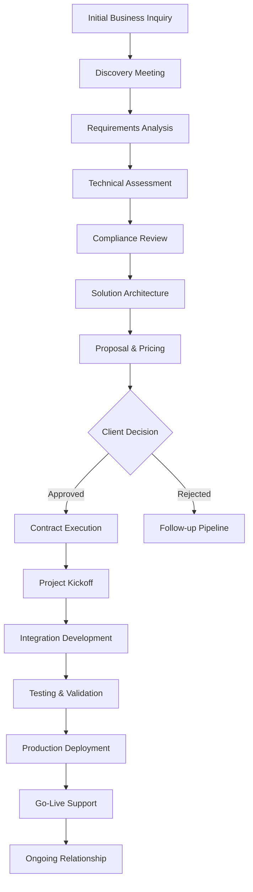
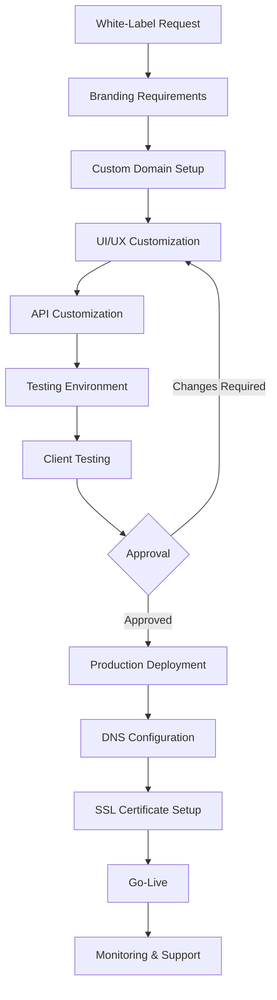
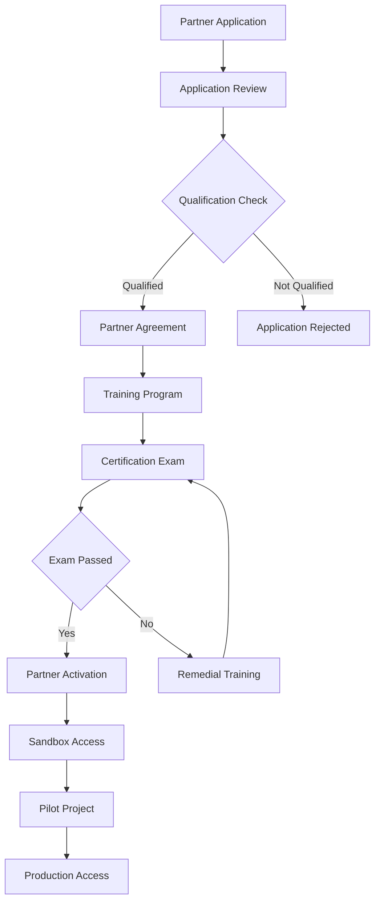

# 🏢 Veridity Business Integration Flows

Comprehensive business workflow documentation for enterprise clients, API integrations, and white-label solutions on the Veridity platform.

## 🎯 Overview

This document outlines all business integration workflows within the Veridity platform, from enterprise client onboarding to complete white-label deployments and partner verification services.

## 🏗️ Enterprise Client Types

### Client Classification
```typescript
interface EnterpriseClient {
  id: string;
  name: string;
  type: 'government' | 'financial' | 'education' | 'healthcare' | 'corporate';
  tier: 'startup' | 'growth' | 'enterprise' | 'government';
  region: string;
  complianceRequirements: ComplianceRequirement[];
  integration: IntegrationType;
  contractTerms: ContractTerms;
}

interface ComplianceRequirement {
  standard: 'GDPR' | 'SOC2' | 'ISO27001' | 'HIPAA' | 'PCI_DSS' | 'Nepal_DPA';
  level: 'basic' | 'standard' | 'advanced';
  auditRequired: boolean;
  documentation: string[];
}

interface IntegrationType {
  method: 'api' | 'sdk' | 'white_label' | 'hybrid';
  deployment: 'cloud' | 'on_premise' | 'hybrid';
  customization: 'standard' | 'branded' | 'custom';
  sla: ServiceLevelAgreement;
}

const enterpriseClientTypes: EnterpriseClient[] = [
  {
    id: 'nepal_gov',
    name: 'Government of Nepal',
    type: 'government',
    tier: 'government',
    region: 'Nepal',
    complianceRequirements: [
      {
        standard: 'Nepal_DPA',
        level: 'advanced',
        auditRequired: true,
        documentation: ['privacy_policy', 'security_audit', 'data_handling']
      }
    ],
    integration: {
      method: 'hybrid',
      deployment: 'hybrid',
      customization: 'custom',
      sla: {
        uptime: 99.99,
        responseTime: 100,
        support: '24/7'
      }
    },
    contractTerms: {
      pricing: 'custom',
      term: '5_years',
      autoRenewal: false
    }
  }
];
```

## 🚀 Enterprise Client Onboarding Flow



### 1. Discovery & Requirements Phase

```typescript
interface BusinessRequirements {
  clientId: string;
  useCases: UseCase[];
  volumeEstimates: VolumeEstimate;
  integrationRequirements: IntegrationRequirement[];
  complianceNeeds: ComplianceNeed[];
  timeline: ProjectTimeline;
  budget: BudgetRange;
}

interface UseCase {
  id: string;
  name: string;
  description: string;
  priority: 'critical' | 'high' | 'medium' | 'low';
  verificationTypes: string[];
  expectedVolume: number;
  userTypes: string[];
  specialRequirements?: string[];
}

interface VolumeEstimate {
  dailyVerifications: number;
  peakHourlyRate: number;
  annualGrowthRate: number;
  seasonalVariations: Array<{
    period: string;
    multiplier: number;
  }>;
}

class EnterpriseOnboardingService {
  async initiateDiscovery(clientInfo: ClientInquiry): Promise<DiscoverySession> {
    // Create discovery session
    const session: DiscoverySession = {
      id: generateId(),
      clientId: clientInfo.clientId,
      status: 'scheduled',
      scheduledDate: new Date(Date.now() + 7 * 24 * 60 * 60 * 1000),
      agenda: [
        'Business objectives overview',
        'Current identity verification challenges',
        'Technical infrastructure assessment',
        'Compliance and security requirements',
        'Integration preferences',
        'Success criteria definition'
      ],
      participants: {
        client: clientInfo.contacts,
        veridity: await this.assignSalesTeam(clientInfo)
      }
    };

    // Prepare discovery materials
    await this.prepareDiscoveryMaterials(session);

    // Send calendar invitation
    await this.sendDiscoveryInvitation(session);

    return session;
  }

  async conductRequirementsAnalysis(
    sessionNotes: DiscoveryNotes
  ): Promise<BusinessRequirements> {
    const requirements: BusinessRequirements = {
      clientId: sessionNotes.clientId,
      useCases: await this.extractUseCases(sessionNotes),
      volumeEstimates: await this.calculateVolumeEstimates(sessionNotes),
      integrationRequirements: await this.analyzeIntegrationNeeds(sessionNotes),
      complianceNeeds: await this.assessComplianceRequirements(sessionNotes),
      timeline: await this.buildProjectTimeline(sessionNotes),
      budget: await this.estimateBudgetRange(sessionNotes)
    };

    // Validate requirements
    const validation = await this.validateRequirements(requirements);
    if (!validation.isValid) {
      throw new Error(`Requirements validation failed: ${validation.errors.join(', ')}`);
    }

    return requirements;
  }

  private async extractUseCases(notes: DiscoveryNotes): Promise<UseCase[]> {
    const useCases: UseCase[] = [];

    // Age verification for online services
    if (notes.mentions.includes('age_verification')) {
      useCases.push({
        id: 'age_verification',
        name: 'Age Verification for Digital Services',
        description: 'Verify user age without exposing birth date',
        priority: 'high',
        verificationTypes: ['age_over_18', 'age_over_21'],
        expectedVolume: notes.estimatedVolume?.daily || 1000,
        userTypes: ['consumers', 'citizens'],
        specialRequirements: ['zero_knowledge', 'real_time']
      });
    }

    // Educational credential verification
    if (notes.mentions.includes('education_verification')) {
      useCases.push({
        id: 'education_verification',
        name: 'Educational Credential Verification',
        description: 'Verify academic qualifications from Nepal institutions',
        priority: 'high',
        verificationTypes: ['degree_verification', 'transcript_verification'],
        expectedVolume: notes.estimatedVolume?.daily || 500,
        userTypes: ['job_applicants', 'students'],
        specialRequirements: ['government_integration', 'batch_processing']
      });
    }

    return useCases;
  }
}
```

### 2. Technical Integration Architecture

```typescript
interface TechnicalArchitecture {
  clientId: string;
  deploymentModel: DeploymentModel;
  apiIntegration: APIIntegrationSpec;
  sdkRequirements: SDKRequirements;
  customizations: Customization[];
  securityRequirements: SecuritySpec;
  performanceRequirements: PerformanceSpec;
}

interface DeploymentModel {
  type: 'cloud' | 'on_premise' | 'hybrid';
  cloudProvider?: 'aws' | 'azure' | 'gcp' | 'nepal_cloud';
  regions: string[];
  dataResidency: DataResidencyRequirement;
  scalingStrategy: ScalingStrategy;
}

interface APIIntegrationSpec {
  endpoints: APIEndpoint[];
  authentication: AuthenticationMethod;
  rateLimit: RateLimit;
  webhooks: WebhookConfiguration[];
  monitoring: MonitoringConfiguration;
}

interface APIEndpoint {
  path: string;
  method: 'GET' | 'POST' | 'PUT' | 'DELETE';
  purpose: string;
  requestSchema: object;
  responseSchema: object;
  rateLimits: {
    requests: number;
    window: string;
  };
  requiredScopes: string[];
}

const technicalArchitectureTemplates = {
  government: {
    deploymentModel: {
      type: 'hybrid',
      regions: ['nepal_central', 'nepal_backup'],
      dataResidency: {
        citizenData: 'nepal_only',
        verificationProofs: 'nepal_only',
        auditLogs: 'nepal_only'
      },
      scalingStrategy: {
        type: 'auto',
        minInstances: 3,
        maxInstances: 50,
        targetCPU: 70
      }
    },
    apiIntegration: {
      endpoints: [
        {
          path: '/v1/government/verify-citizenship',
          method: 'POST',
          purpose: 'Verify Nepal citizenship certificate',
          requestSchema: {
            type: 'object',
            properties: {
              citizenshipNumber: { type: 'string' },
              consentToken: { type: 'string' }
            }
          },
          responseSchema: {
            type: 'object',
            properties: {
              verified: { type: 'boolean' },
              proofHash: { type: 'string' },
              verificationId: { type: 'string' }
            }
          },
          rateLimits: { requests: 1000, window: '1h' },
          requiredScopes: ['gov:citizenship:verify']
        }
      ],
      authentication: {
        type: 'oauth2_mtls',
        tokenEndpoint: '/oauth/token',
        certificateValidation: true,
        additionalSecurity: ['ip_whitelist', 'geo_blocking']
      }
    }
  },

  financial: {
    deploymentModel: {
      type: 'cloud',
      cloudProvider: 'aws',
      regions: ['ap-south-1', 'us-east-1'],
      dataResidency: {
        customerData: 'region_preference',
        verificationProofs: 'global_allowed',
        auditLogs: 'region_preference'
      }
    },
    apiIntegration: {
      endpoints: [
        {
          path: '/v1/finance/verify-income',
          method: 'POST',
          purpose: 'Verify income range without revealing exact amount',
          requestSchema: {
            type: 'object',
            properties: {
              userConsent: { type: 'string' },
              incomeThreshold: { type: 'number' },
              verificationPeriod: { type: 'string' }
            }
          },
          responseSchema: {
            type: 'object',
            properties: {
              meetsThreshold: { type: 'boolean' },
              proofHash: { type: 'string' },
              verificationId: { type: 'string' },
              expiresAt: { type: 'string' }
            }
          },
          rateLimits: { requests: 500, window: '1h' },
          requiredScopes: ['finance:income:verify']
        }
      ]
    }
  }
};
```

### 3. White-Label Solution Deployment



```typescript
interface WhiteLabelConfiguration {
  clientId: string;
  branding: BrandingConfiguration;
  domain: DomainConfiguration;
  customization: UICustomization;
  features: FeatureConfiguration;
  deployment: DeploymentConfiguration;
}

interface BrandingConfiguration {
  companyName: string;
  logo: {
    primary: string;
    secondary?: string;
    favicon: string;
  };
  colorScheme: {
    primary: string;
    secondary: string;
    accent: string;
    background: string;
    text: string;
  };
  typography: {
    fontFamily: string;
    headingFont?: string;
  };
  customCSS?: string;
}

interface UICustomization {
  layout: 'default' | 'sidebar' | 'topnav' | 'custom';
  theme: 'light' | 'dark' | 'auto';
  language: {
    primary: 'en' | 'ne';
    supported: string[];
    customTranslations?: Record<string, string>;
  };
  pages: CustomPage[];
  components: ComponentCustomization[];
}

interface FeatureConfiguration {
  verificationTypes: string[];
  integrations: {
    governmentAPIs: boolean;
    educationAPIs: boolean;
    customAPIs: string[];
  };
  analytics: {
    enabled: boolean;
    customDashboard: boolean;
    exportFormats: string[];
  };
  whiteLabel: {
    hidePoweredBy: boolean;
    customFooter: string;
    customTerms: string;
  };
}

class WhiteLabelDeploymentService {
  async createWhiteLabelDeployment(
    config: WhiteLabelConfiguration
  ): Promise<WhiteLabelDeployment> {
    // Validate configuration
    await this.validateConfiguration(config);

    // Create deployment instance
    const deployment: WhiteLabelDeployment = {
      id: generateId(),
      clientId: config.clientId,
      status: 'creating',
      config,
      infrastructure: await this.provisionInfrastructure(config),
      endpoints: await this.generateEndpoints(config),
      createdAt: new Date()
    };

    try {
      // Deploy infrastructure
      await this.deployInfrastructure(deployment);

      // Configure branding
      await this.applyBranding(deployment);

      // Setup custom domain
      await this.configureDomain(deployment);

      // Deploy application
      await this.deployApplication(deployment);

      // Configure monitoring
      await this.setupMonitoring(deployment);

      deployment.status = 'active';
      await this.saveDeployment(deployment);

      return deployment;

    } catch (error) {
      deployment.status = 'failed';
      await this.cleanupFailedDeployment(deployment);
      throw error;
    }
  }

  private async applyBranding(deployment: WhiteLabelDeployment): Promise<void> {
    const branding = deployment.config.branding;

    // Generate custom CSS
    const customCSS = `
      :root {
        --primary-color: ${branding.colorScheme.primary};
        --secondary-color: ${branding.colorScheme.secondary};
        --accent-color: ${branding.colorScheme.accent};
        --background-color: ${branding.colorScheme.background};
        --text-color: ${branding.colorScheme.text};
        --font-family: ${branding.typography.fontFamily};
        --heading-font: ${branding.typography.headingFont || branding.typography.fontFamily};
      }

      .logo {
        background-image: url('${branding.logo.primary}');
      }

      ${branding.customCSS || ''}
    `;

    // Upload assets
    await this.uploadBrandingAssets(deployment.id, branding);

    // Apply CSS
    await this.applyCSSConfiguration(deployment.id, customCSS);

    // Configure site metadata
    await this.configureSiteMetadata(deployment.id, {
      title: `${branding.companyName} - Identity Verification`,
      favicon: branding.logo.favicon,
      description: `Secure identity verification powered by ${branding.companyName}`
    });
  }

  async configureDomain(deployment: WhiteLabelDeployment): Promise<void> {
    const domainConfig = deployment.config.domain;

    if (domainConfig.customDomain) {
      // Setup custom domain
      await this.createCNAMERecord(domainConfig.customDomain, deployment.endpoints.primary);

      // Configure SSL certificate
      await this.provisionSSLCertificate(domainConfig.customDomain);

      // Update load balancer
      await this.updateLoadBalancerConfig(deployment.id, domainConfig.customDomain);

      // Verify domain ownership
      await this.verifyDomainOwnership(domainConfig.customDomain);
    }
  }
}
```

## 📊 Partner Verification Services

### Partner Integration Models

```typescript
interface PartnerIntegration {
  partnerId: string;
  partnerType: 'system_integrator' | 'reseller' | 'technology_partner' | 'consultant';
  integrationModel: IntegrationModel;
  certificationLevel: CertificationLevel;
  supportTier: SupportTier;
  revenue: RevenueModel;
}

interface IntegrationModel {
  type: 'referral' | 'white_label' | 'api_reseller' | 'managed_service';
  commissionStructure: CommissionStructure;
  technicalRequirements: TechnicalRequirement[];
  marketingSupport: MarketingSupport;
  trainingProgram: TrainingProgram;
}

interface CertificationLevel {
  level: 'basic' | 'advanced' | 'expert';
  requirements: string[];
  benefits: string[];
  renewalPeriod: string;
  examRequired: boolean;
}

const partnerPrograms = {
  systemIntegrator: {
    certificationLevels: [
      {
        level: 'basic',
        requirements: [
          'Complete 40-hour training program',
          'Implement 2 successful pilot projects',
          'Pass technical certification exam'
        ],
        benefits: [
          '15% commission on referred clients',
          'Technical documentation access',
          'Email support within 24 hours'
        ],
        renewalPeriod: '1 year',
        examRequired: true
      },
      {
        level: 'advanced',
        requirements: [
          'Basic certification',
          'Complete 20 additional training hours',
          'Implement 5 successful projects',
          'Demonstrate custom integration capabilities'
        ],
        benefits: [
          '20% commission on referred clients',
          'Priority technical support',
          'Access to beta features',
          'Co-marketing opportunities'
        ],
        renewalPeriod: '2 years',
        examRequired: true
      }
    ]
  }
};
```

### Partner Onboarding Flow



```typescript
class PartnerOnboardingService {
  async processPartnerApplication(application: PartnerApplication): Promise<OnboardingResult> {
    // Validate application
    const validation = await this.validateApplication(application);
    if (!validation.isValid) {
      return {
        status: 'rejected',
        reason: 'application_invalid',
        details: validation.errors
      };
    }

    // Check qualification criteria
    const qualification = await this.assessQualification(application);
    if (!qualification.qualified) {
      return {
        status: 'rejected',
        reason: 'not_qualified',
        details: qualification.reasons
      };
    }

    // Create partner record
    const partner = await this.createPartner(application);

    // Initiate onboarding process
    const onboarding = await this.startOnboardingProcess(partner);

    return {
      status: 'approved',
      partnerId: partner.id,
      onboardingId: onboarding.id,
      nextSteps: onboarding.nextSteps
    };
  }

  private async assessQualification(application: PartnerApplication): Promise<QualificationResult> {
    const criteria = this.getQualificationCriteria(application.partnerType);
    const results: QualificationCheck[] = [];

    for (const criterion of criteria) {
      const result = await this.checkCriterion(application, criterion);
      results.push(result);
    }

    const qualified = results.every(r => r.passed);
    const reasons = results.filter(r => !r.passed).map(r => r.reason);

    return { qualified, reasons, details: results };
  }

  async conductTrainingProgram(partnerId: string): Promise<TrainingResult> {
    const partner = await this.getPartner(partnerId);
    const trainingPlan = await this.createTrainingPlan(partner);

    const trainingSession: TrainingSession = {
      id: generateId(),
      partnerId,
      plan: trainingPlan,
      status: 'in_progress',
      startedAt: new Date(),
      modules: await this.getTrainingModules(partner.type),
      progress: 0
    };

    // Track training progress
    await this.trackTrainingProgress(trainingSession);

    return {
      sessionId: trainingSession.id,
      estimatedCompletion: this.calculateCompletionTime(trainingPlan),
      modules: trainingSession.modules.map(m => ({
        id: m.id,
        name: m.name,
        duration: m.duration,
        status: 'pending'
      }))
    };
  }
}
```

## 🔄 API Integration Workflows

### Integration Testing & Validation

```typescript
interface IntegrationTestSuite {
  clientId: string;
  testCases: TestCase[];
  environment: 'sandbox' | 'staging' | 'production';
  results: TestResult[];
  compliance: ComplianceTest[];
}

interface TestCase {
  id: string;
  name: string;
  category: 'authentication' | 'verification' | 'error_handling' | 'performance';
  description: string;
  steps: TestStep[];
  expectedResult: any;
  actualResult?: any;
  status: 'pending' | 'running' | 'passed' | 'failed';
}

interface TestStep {
  action: string;
  endpoint: string;
  method: string;
  payload?: any;
  headers?: Record<string, string>;
  expectedStatus: number;
  validation: ValidationRule[];
}

class IntegrationTestingService {
  async runIntegrationTests(clientId: string): Promise<IntegrationTestResult> {
    const testSuite = await this.generateTestSuite(clientId);
    const results: TestResult[] = [];

    for (const testCase of testSuite.testCases) {
      try {
        const result = await this.executeTestCase(testCase);
        results.push(result);
      } catch (error) {
        results.push({
          testCaseId: testCase.id,
          status: 'failed',
          error: error.message,
          timestamp: new Date()
        });
      }
    }

    const report = await this.generateTestReport(results);
    return {
      testSuiteId: testSuite.id,
      totalTests: testSuite.testCases.length,
      passed: results.filter(r => r.status === 'passed').length,
      failed: results.filter(r => r.status === 'failed').length,
      duration: this.calculateTestDuration(results),
      report
    };
  }

  private async executeTestCase(testCase: TestCase): Promise<TestResult> {
    const startTime = Date.now();

    for (const step of testCase.steps) {
      const response = await this.executeTestStep(step);

      // Validate response
      const validation = await this.validateResponse(response, step.validation);
      if (!validation.isValid) {
        return {
          testCaseId: testCase.id,
          status: 'failed',
          step: step.action,
          error: validation.errors.join(', '),
          timestamp: new Date(),
          duration: Date.now() - startTime
        };
      }
    }

    return {
      testCaseId: testCase.id,
      status: 'passed',
      timestamp: new Date(),
      duration: Date.now() - startTime
    };
  }
}
```

## 📈 Compliance & Audit Flows

### Automated Compliance Monitoring

```typescript
interface ComplianceFramework {
  standard: 'GDPR' | 'SOC2' | 'ISO27001' | 'Nepal_DPA';
  requirements: ComplianceRequirement[];
  monitoring: MonitoringRule[];
  reporting: ReportingConfiguration;
}

interface ComplianceRequirement {
  id: string;
  category: 'data_protection' | 'access_control' | 'audit_logging' | 'incident_response';
  description: string;
  implementation: ImplementationCheck[];
  testing: TestingProcedure[];
  frequency: 'continuous' | 'daily' | 'weekly' | 'monthly' | 'quarterly';
}

interface AuditTrail {
  id: string;
  timestamp: Date;
  actor: string;
  action: string;
  resource: string;
  details: any;
  ipAddress: string;
  userAgent: string;
  sessionId: string;
  compliance: ComplianceTag[];
}

class ComplianceMonitoringService {
  async performComplianceCheck(standard: string): Promise<ComplianceReport> {
    const framework = await this.getComplianceFramework(standard);
    const results: ComplianceCheckResult[] = [];

    for (const requirement of framework.requirements) {
      const result = await this.checkRequirement(requirement);
      results.push(result);
    }

    const report: ComplianceReport = {
      standard,
      timestamp: new Date(),
      overallStatus: this.calculateOverallStatus(results),
      requirements: results,
      recommendations: await this.generateRecommendations(results),
      nextAuditDate: this.calculateNextAuditDate(standard)
    };

    await this.saveComplianceReport(report);
    return report;
  }

  async generateAuditReport(
    clientId: string,
    timeRange: DateRange,
    standards: string[]
  ): Promise<AuditReport> {
    const auditTrail = await this.getAuditTrail(clientId, timeRange);
    const complianceStatus = await this.getComplianceStatus(clientId, standards);

    const report: AuditReport = {
      clientId,
      reportId: generateId(),
      generatedAt: new Date(),
      timeRange,
      standards,
      auditTrail: {
        totalEvents: auditTrail.length,
        eventsByCategory: this.categorizeEvents(auditTrail),
        suspiciousActivities: this.identifySuspiciousActivities(auditTrail)
      },
      compliance: complianceStatus,
      recommendations: await this.generateAuditRecommendations(auditTrail, complianceStatus),
      certification: await this.generateCertification(clientId, standards)
    };

    return report;
  }
}
```

## 🎯 Success Metrics & KPIs

### Business Integration Analytics

```typescript
interface BusinessMetrics {
  clientId: string;
  timeRange: DateRange;
  integration: IntegrationMetrics;
  usage: UsageMetrics;
  performance: PerformanceMetrics;
  business: BusinessImpactMetrics;
}

interface IntegrationMetrics {
  apiCalls: {
    total: number;
    successful: number;
    failed: number;
    averageResponseTime: number;
  };
  verifications: {
    total: number;
    byType: Record<string, number>;
    successRate: number;
    fraudPrevented: number;
  };
  uptime: {
    percentage: number;
    incidents: number;
    mttr: number;
  };
}

interface BusinessImpactMetrics {
  userAcquisition: {
    conversionRate: number;
    verificationDropOff: number;
    userSatisfaction: number;
  };
  operational: {
    manualVerificationReduction: number;
    processingTimeReduction: number;
    costSavings: number;
  };
  compliance: {
    auditReadiness: number;
    privacyScore: number;
    riskReduction: number;
  };
}

const enterpriseReporting = {
  dashboard: {
    realTimeMetrics: [
      'active_verifications',
      'api_response_time',
      'success_rate',
      'error_rate'
    ],
    businessKPIs: [
      'verification_volume',
      'user_conversion',
      'cost_per_verification',
      'compliance_score'
    ],
    alerts: [
      { metric: 'error_rate', threshold: 0.05, action: 'notify_admin' },
      { metric: 'response_time', threshold: 500, action: 'scale_infrastructure' }
    ]
  },

  reporting: {
    automated: [
      { frequency: 'daily', report: 'operational_summary' },
      { frequency: 'weekly', report: 'business_metrics' },
      { frequency: 'monthly', report: 'compliance_status' },
      { frequency: 'quarterly', report: 'business_review' }
    ],

    customizable: {
      metrics: 'selectable',
      timeRanges: 'flexible',
      formats: ['pdf', 'excel', 'api'],
      distribution: 'automated'
    }
  }
};
```

---

**Business Integration Documentation Version**: 1.0 | **Last Updated**: January 2025
**Enterprise Support**: enterprise@veridity.np | **Partner Program**: partners@veridity.np
**Compliance Certification**: ISO 27001, SOC 2 Type II, Nepal DPA Compliant
