# 👥 Veridity User Flows

Comprehensive user journey documentation for the Veridity privacy-first identity platform.

## 🎯 Overview

This document outlines all user interaction flows within the Veridity platform, from initial onboarding to advanced zero-knowledge proof generation.

## 📊 User Types & Personas

### Primary Users
1. **Citizens** - Nepal citizens requiring identity verification
2. **Students** - Academic credential verification
3. **Workers** - Employment and income verification
4. **Rural Users** - Remote area access with limited connectivity
5. **International Users** - Cross-border verification needs

### User Characteristics
```
Age Range: 18-65 years
Tech Literacy: Basic to Advanced
Device Usage: 68% Mobile, 25% Desktop, 7% Tablet
Languages: Nepali (78%), English (22%)
Internet: 45% Rural (Limited), 55% Urban (High-speed)
```

## 🚀 Core User Flows

### 1. First-Time User Onboarding

```mermaid
graph TD
    A[Landing Page] --> B{Language Selection}
    B -->|English| C[Welcome Tour EN]
    B -->|नेपाली| D[Welcome Tour NE]
    C --> E[Privacy Explanation]
    D --> E
    E --> F[Zero-Knowledge Demo]
    F --> G[Choose Verification Type]
    G --> H[Create Session]
    H --> I[Dashboard Access]
```



#### Step-by-Step Breakdown

**Step 1: Landing Page Entry**
```typescript
// User lands on https://veridity-nepal.netlify.app
interface LandingPageState {
  userAgent: string;
  location: string;
  referrer: string;
  timestamp: Date;
}

// Auto-detect language preference
const detectLanguage = (headers: Headers): Language => {
  const acceptLanguage = headers.get('accept-language');
  return acceptLanguage?.includes('ne') ? 'ne' : 'en';
};
```

**Step 2: Language Selection**
- **Purpose**: Ensure comfortable user experience
- **Options**: English, नेपाली (Nepali)
- **Persistence**: Saved to localStorage
- **Impact**: Affects all subsequent UI elements

```typescript
// Language selection component
interface LanguageSelectionProps {
  onLanguageSelect: (language: 'en' | 'ne') => void;
  autoDetected: 'en' | 'ne';
}

const LanguageSelection = ({ onLanguageSelect, autoDetected }: LanguageSelectionProps) => {
  return (
    <div className="language-selector">
      <h1>{autoDetected === 'ne' ? 'भाषा छान्नुहोस्' : 'Choose Language'}</h1>
      <button onClick={() => onLanguageSelect('en')}>
        🇺🇸 English
      </button>
      <button onClick={() => onLanguageSelect('ne')}>
        🇳🇵 नेपाली
      </button>
    </div>
  );
};
```

**Step 3: Privacy-First Welcome Tour**
```typescript
// Welcome tour steps
const welcomeSteps = [
  {
    title: { en: "Privacy First", ne: "गोपनीयता प्राथमिकता" },
    content: {
      en: "Your personal data never leaves your device. We use zero-knowledge proofs to verify without exposing.",
      ne: "तपाईंको व्यक्तिगत डाटा कहिल्यै तपाईंको उपकरणबाट बाहिर जाँदैन।"
    },
    animation: "privacy-shield"
  },
  {
    title: { en: "Zero Knowledge", ne: "शून्य ज्ञान प्रमाण" },
    content: {
      en: "Prove you're over 18 without revealing your birth date. Magic of mathematics!",
      ne: "आफ्नो जन्म मिति नभनेर १८ वर्ष भएको प्रमाणित गर्नुहोस्।"
    },
    animation: "zk-proof-demo"
  }
];
```

**Step 4: Interactive ZK Demo**
- **Purpose**: Build trust through understanding
- **Duration**: 2-3 minutes
- **Interaction**: Live proof generation
- **Languages**: Fully localized explanations

### 2. Age Verification Flow


#### Detailed Flow Implementation

**Phase 1: Verification Setup**
```typescript
interface AgeVerificationRequest {
  sessionId: string;
  requiredAge: number;        // Public: minimum age requirement
  privacyLevel: 'standard' | 'high' | 'maximum';
  consentGiven: boolean;
}

// Privacy notice component
const PrivacyNotice = ({ onConsent }: { onConsent: (given: boolean) => void }) => {
  const { t } = useLanguage();

  return (
    <div className="privacy-notice">
      <h2>{t.verification.privacy.title}</h2>
      <ul>
        <li>✅ {t.verification.privacy.noDataStored}</li>
        <li>✅ {t.verification.privacy.mathematicalProof}</li>
        <li>✅ {t.verification.privacy.instantVerification}</li>
      </ul>
      <button onClick={() => onConsent(true)}>
        {t.verification.privacy.consent}
      </button>
    </div>
  );
};
```

**Phase 2: Data Input with Security**
```typescript
interface BirthDateInput {
  value: string;
  isValid: boolean;
  errorMessage?: string;
}

const SecureBirthDateInput = ({ onDateSubmit }: { onDateSubmit: (date: string) => void }) => {
  const [date, setDate] = useState<BirthDateInput>({ value: '', isValid: false });

  const validateDate = (dateString: string): boolean => {
    const birthDate = new Date(dateString);
    const now = new Date();
    const minAge = new Date(now.getFullYear() - 150, now.getMonth(), now.getDate());

    return birthDate > minAge && birthDate < now;
  };

  const handleSubmit = () => {
    if (validateDate(date.value)) {
      // Secure local processing only
      onDateSubmit(date.value);
    }
  };

  return (
    <div className="secure-input">
      <input
        type="date"
        value={date.value}
        onChange={(e) => setDate({
          value: e.target.value,
          isValid: validateDate(e.target.value)
        })}
        max={new Date().toISOString().split('T')[0]}
      />
      <div className="security-indicators">
        🔒 Data stays on your device
        🔐 Zero-knowledge processing
      </div>
    </div>
  );
};
```

**Phase 3: Zero-Knowledge Proof Generation**
```typescript
interface ZKProofGeneration {
  status: 'generating' | 'complete' | 'error';
  progress: number;
  estimatedTime: number;
  proof?: ZKProof;
}

const ProofGenerationFlow = ({ birthDate, minAge }: { birthDate: string, minAge: number }) => {
  const [generation, setGeneration] = useState<ZKProofGeneration>({
    status: 'generating',
    progress: 0,
    estimatedTime: 1200
  });

  useEffect(() => {
    const generateProof = async () => {
      try {
        // Progress updates for user feedback
        const progressInterval = setInterval(() => {
          setGeneration(prev => ({
            ...prev,
            progress: Math.min(prev.progress + 10, 90)
          }));
        }, 100);

        // Actual proof generation
        const proof = await zkProofGenerator.generateAgeProof({
          birthDate,
          minimumAge: minAge,
          proofType: 'age_over_18'
        });

        clearInterval(progressInterval);
        setGeneration({
          status: 'complete',
          progress: 100,
          estimatedTime: 0,
          proof
        });

      } catch (error) {
        setGeneration({
          status: 'error',
          progress: 0,
          estimatedTime: 0
        });
      }
    };

    generateProof();
  }, [birthDate, minAge]);

  return (
    <div className="proof-generation">
      <ProgressIndicator
        progress={generation.progress}
        estimatedTime={generation.estimatedTime}
      />
      {generation.status === 'complete' && (
        <ProofResult proof={generation.proof!} />
      )}
    </div>
  );
};
```

**Phase 4: Verification Result & Certificate**
```typescript
interface VerificationCertificate {
  id: string;
  type: 'age_verification';
  isValid: boolean;
  timestamp: Date;
  proofHash: string;
  issuer: 'veridity_platform';
  expiresAt: Date;
}

const VerificationResult = ({ proof }: { proof: ZKProof }) => {
  const { t } = useLanguage();
  const [certificate, setCertificate] = useState<VerificationCertificate | null>(null);

  const generateCertificate = () => {
    const cert: VerificationCertificate = {
      id: generateId(),
      type: 'age_verification',
      isValid: true,
      timestamp: new Date(),
      proofHash: proof.proof.substring(0, 16) + '...',
      issuer: 'veridity_platform',
      expiresAt: new Date(Date.now() + 30 * 24 * 60 * 60 * 1000) // 30 days
    };
    setCertificate(cert);
  };

  return (
    <div className="verification-result">
      <div className="success-indicator">
        ✅ {t.verification.success.title}
      </div>
      <div className="proof-details">
        <h3>{t.verification.success.proofGenerated}</h3>
        <code>{proof.proof.substring(0, 40)}...</code>
      </div>
      <div className="actions">
        <button onClick={generateCertificate}>
          📄 {t.verification.success.downloadCertificate}
        </button>
        <button onClick={() => navigator.share({
          title: 'Age Verification Complete',
          text: 'I have completed age verification using zero-knowledge proofs'
        })}>
          📤 {t.verification.success.share}
        </button>
      </div>
    </div>
  );
};
```

### 3. Education Credential Verification Flow


#### Implementation Details

**Institution Selection**
```typescript
interface EducationInstitution {
  id: string;
  name: string;
  nameNe: string;
  type: 'university' | 'college' | 'institute';
  established: number;
  apiIntegration: boolean;
  verificationMethods: string[];
}

const institutionList: EducationInstitution[] = [
  {
    id: 'tu',
    name: 'Tribhuvan University',
    nameNe: 'त्रिभुवन विश्वविद्यालय',
    type: 'university',
    established: 1959,
    apiIntegration: true,
    verificationMethods: ['api', 'document', 'manual']
  },
  {
    id: 'ku',
    name: 'Kathmandu University',
    nameNe: 'काठमाडौं विश्वविद्यालय',
    type: 'university',
    established: 1991,
    apiIntegration: true,
    verificationMethods: ['api', 'document']
  }
];

const InstitutionSelector = ({ onSelect }: { onSelect: (institution: EducationInstitution) => void }) => {
  const { t, language } = useLanguage();

  return (
    <div className="institution-selector">
      <h2>{t.education.selectInstitution}</h2>
      <div className="institution-grid">
        {institutionList.map(institution => (
          <div
            key={institution.id}
            className="institution-card"
            onClick={() => onSelect(institution)}
          >
            <h3>{language === 'ne' ? institution.nameNe : institution.name}</h3>
            <p>{t.education.established}: {institution.established}</p>
            <div className="integration-status">
              {institution.apiIntegration ? (
                <span className="status-active">🟢 {t.education.apiIntegrated}</span>
              ) : (
                <span className="status-manual">🟡 {t.education.manualVerification}</span>
              )}
            </div>
          </div>
        ))}
      </div>
    </div>
  );
};
```

**Degree Information Input**
```typescript
interface DegreeInformation {
  level: 'bachelor' | 'master' | 'phd' | 'diploma';
  field: string;
  graduationYear: number;
  rollNumber?: string;
  gpa?: number;
}

const DegreeInputForm = ({
  institution,
  onSubmit
}: {
  institution: EducationInstitution;
  onSubmit: (degree: DegreeInformation) => void;
}) => {
  const [degree, setDegree] = useState<DegreeInformation>({
    level: 'bachelor',
    field: '',
    graduationYear: new Date().getFullYear()
  });

  const degreeFields = {
    'tu': [
      { id: 'computer_science', name: 'Computer Science', nameNe: 'कम्प्युटर विज्ञान' },
      { id: 'engineering', name: 'Engineering', nameNe: 'इन्जिनियरिङ' },
      { id: 'management', name: 'Management', nameNe: 'व्यवस्थापन' },
      { id: 'arts', name: 'Arts', nameNe: 'कला' }
    ]
  };

  return (
    <form onSubmit={(e) => { e.preventDefault(); onSubmit(degree); }}>
      <div className="form-group">
        <label>{t.education.degreeLevel}</label>
        <select
          value={degree.level}
          onChange={(e) => setDegree({...degree, level: e.target.value as any})}
        >
          <option value="bachelor">{t.education.bachelor}</option>
          <option value="master">{t.education.master}</option>
          <option value="phd">{t.education.phd}</option>
        </select>
      </div>

      <div className="form-group">
        <label>{t.education.field}</label>
        <select
          value={degree.field}
          onChange={(e) => setDegree({...degree, field: e.target.value})}
        >
          {degreeFields[institution.id]?.map(field => (
            <option key={field.id} value={field.id}>
              {language === 'ne' ? field.nameNe : field.name}
            </option>
          ))}
        </select>
      </div>

      <div className="security-notice">
        🔒 {t.education.privacyNotice}
      </div>

      <button type="submit">{t.education.verifyDegree}</button>
    </form>
  );
};
```

### 4. Government Service Integration Flow


#### Government Service Integration

**Service Selection Interface**
```typescript
interface GovernmentService {
  id: string;
  name: string;
  nameNe: string;
  agency: string;
  agencyNe: string;
  description: string;
  descriptionNe: string;
  dataRequired: string[];
  privacyLevel: 'high' | 'medium' | 'standard';
  estimatedTime: string;
  availability: 'online' | 'offline' | 'maintenance';
}

const governmentServices: GovernmentService[] = [
  {
    id: 'citizenship_verification',
    name: 'Citizenship Verification',
    nameNe: 'नागरिकता प्रमाणीकरण',
    agency: 'Ministry of Home Affairs',
    agencyNe: 'गृह मन्त्रालय',
    description: 'Verify Nepal citizenship certificate',
    descriptionNe: 'नेपाली नागरिकता प्रमाणपत्र प्रमाणीकरण',
    dataRequired: ['citizenship_number', 'full_name'],
    privacyLevel: 'high',
    estimatedTime: '2-3 minutes',
    availability: 'online'
  },
  {
    id: 'academic_verification',
    name: 'Academic Record Verification',
    nameNe: 'शैक्षणिक रेकर्ड प्रमाणीकरण',
    agency: 'Tribhuvan University',
    agencyNe: 'त्रिभुवन विश्वविद्यालय',
    description: 'Verify academic degrees and transcripts',
    descriptionNe: 'शैक्षणिक डिग्री र ट्रान्स्क्रिप्ट प्रमाणीकरण',
    dataRequired: ['degree_id', 'graduation_year'],
    privacyLevel: 'medium',
    estimatedTime: '1-2 minutes',
    availability: 'online'
  }
];

const GovernmentServiceSelector = ({
  onServiceSelect
}: {
  onServiceSelect: (service: GovernmentService) => void;
}) => {
  const { t, language } = useLanguage();

  return (
    <div className="service-selector">
      <h2>{t.government.selectService}</h2>
      <div className="services-grid">
        {governmentServices.map(service => (
          <div
            key={service.id}
            className={`service-card ${service.availability}`}
            onClick={() => service.availability === 'online' && onServiceSelect(service)}
          >
            <div className="service-header">
              <h3>{language === 'ne' ? service.nameNe : service.name}</h3>
              <span className="agency">
                {language === 'ne' ? service.agencyNe : service.agency}
              </span>
            </div>

            <p className="description">
              {language === 'ne' ? service.descriptionNe : service.description}
            </p>

            <div className="service-metadata">
              <div className="privacy-level">
                🔒 {t.government.privacyLevel}: {service.privacyLevel}
              </div>
              <div className="estimated-time">
                ⏱️ {service.estimatedTime}
              </div>
              <div className={`availability ${service.availability}`}>
                {service.availability === 'online' ? '🟢' : '🔴'}
                {t.government.availability[service.availability]}
              </div>
            </div>

            <div className="data-required">
              <h4>{t.government.dataRequired}:</h4>
              <ul>
                {service.dataRequired.map(data => (
                  <li key={data}>{t.government.dataTypes[data]}</li>
                ))}
              </ul>
            </div>
          </div>
        ))}
      </div>
    </div>
  );
};
```

### 5. Mobile-Optimized Rural User Flow


#### Mobile-First Implementation

**Connection Quality Detection**
```typescript
interface ConnectionQuality {
  type: 'wifi' | '4g' | '3g' | '2g' | 'offline';
  speed: 'fast' | 'medium' | 'slow' | 'none';
  stability: 'stable' | 'unstable' | 'intermittent';
  recommendedMode: 'online' | 'offline' | 'hybrid';
}

const useConnectionQuality = (): ConnectionQuality => {
  const [quality, setQuality] = useState<ConnectionQuality>({
    type: 'offline',
    speed: 'none',
    stability: 'stable',
    recommendedMode: 'offline'
  });

  useEffect(() => {
    const connection = (navigator as any).connection || (navigator as any).mozConnection || (navigator as any).webkitConnection;

    const updateQuality = () => {
      if (!navigator.onLine) {
        setQuality({
          type: 'offline',
          speed: 'none',
          stability: 'stable',
          recommendedMode: 'offline'
        });
        return;
      }

      if (connection) {
        const effectiveType = connection.effectiveType;
        const downlink = connection.downlink;

        setQuality({
          type: effectiveType,
          speed: downlink > 2 ? 'fast' : downlink > 0.5 ? 'medium' : 'slow',
          stability: connection.rtt < 300 ? 'stable' : 'unstable',
          recommendedMode: downlink > 1 ? 'online' : 'hybrid'
        });
      }
    };

    updateQuality();
    window.addEventListener('online', updateQuality);
    window.addEventListener('offline', updateQuality);

    return () => {
      window.removeEventListener('online', updateQuality);
      window.removeEventListener('offline', updateQuality);
    };
  }, []);

  return quality;
};
```

**Offline-Capable Verification**
```typescript
interface OfflineVerificationQueue {
  id: string;
  type: 'age' | 'education' | 'residency';
  data: any;
  proof: ZKProof;
  timestamp: Date;
  syncStatus: 'pending' | 'syncing' | 'synced' | 'failed';
}

const OfflineVerificationManager = () => {
  const [queue, setQueue] = useState<OfflineVerificationQueue[]>([]);
  const connectionQuality = useConnectionQuality();

  const addToQueue = (verification: Omit<OfflineVerificationQueue, 'id' | 'timestamp' | 'syncStatus'>) => {
    const queueItem: OfflineVerificationQueue = {
      ...verification,
      id: generateId(),
      timestamp: new Date(),
      syncStatus: 'pending'
    };

    setQueue(prev => [...prev, queueItem]);

    // Store in IndexedDB for persistence
    storeOfflineVerification(queueItem);
  };

  const syncQueue = async () => {
    if (connectionQuality.recommendedMode === 'offline') return;

    const pendingItems = queue.filter(item => item.syncStatus === 'pending');

    for (const item of pendingItems) {
      try {
        setQueue(prev => prev.map(q =>
          q.id === item.id ? { ...q, syncStatus: 'syncing' } : q
        ));

        await syncVerificationToServer(item);

        setQueue(prev => prev.map(q =>
          q.id === item.id ? { ...q, syncStatus: 'synced' } : q
        ));

      } catch (error) {
        setQueue(prev => prev.map(q =>
          q.id === item.id ? { ...q, syncStatus: 'failed' } : q
        ));
      }
    }
  };

  useEffect(() => {
    if (connectionQuality.speed !== 'none') {
      syncQueue();
    }
  }, [connectionQuality]);

  return (
    <div className="offline-manager">
      <div className="connection-status">
        <ConnectionIndicator quality={connectionQuality} />
      </div>

      <div className="verification-queue">
        <h3>{t.offline.queueTitle}</h3>
        {queue.map(item => (
          <QueueItem key={item.id} item={item} />
        ))}
      </div>
    </div>
  );
};
```

## 🔄 User Journey Analytics

### Conversion Funnel
```typescript
interface UserJourneyMetrics {
  landingPage: number;
  languageSelection: number;
  privacyTour: number;
  verificationStart: number;
  proofGeneration: number;
  verificationComplete: number;
  dropOffPoints: Array<{
    step: string;
    dropOffRate: number;
    commonReasons: string[];
  }>;
}

const journeyMetrics: UserJourneyMetrics = {
  landingPage: 100,
  languageSelection: 87,
  privacyTour: 79,
  verificationStart: 71,
  proofGeneration: 68,
  verificationComplete: 65,
  dropOffPoints: [
    {
      step: 'privacy_tour',
      dropOffRate: 8,
      commonReasons: ['Too complex explanation', 'Privacy concerns', 'Technical difficulties']
    },
    {
      step: 'proof_generation',
      dropOffRate: 3,
      commonReasons: ['Long processing time', 'Technical errors', 'Connection issues']
    }
  ]
};
```

### User Feedback Integration
```typescript
interface UserFeedback {
  step: string;
  rating: number;
  comment?: string;
  difficulty: 'easy' | 'medium' | 'hard';
  suggestions?: string;
  language: 'en' | 'ne';
}

const FeedbackCollector = ({ step }: { step: string }) => {
  const [feedback, setFeedback] = useState<UserFeedback>({
    step,
    rating: 5,
    difficulty: 'easy',
    language: 'en'
  });

  const submitFeedback = async () => {
    // Anonymous feedback collection
    await analytics.track('user_feedback', {
      ...feedback,
      userId: null, // Anonymous
      sessionId: getSessionId(),
      timestamp: new Date()
    });
  };

  return (
    <div className="feedback-collector">
      <h4>{t.feedback.howWasExperience}</h4>
      <StarRating
        value={feedback.rating}
        onChange={(rating) => setFeedback({...feedback, rating})}
      />
      <DifficultySelector
        value={feedback.difficulty}
        onChange={(difficulty) => setFeedback({...feedback, difficulty})}
      />
      <textarea
        placeholder={t.feedback.suggestions}
        value={feedback.suggestions}
        onChange={(e) => setFeedback({...feedback, suggestions: e.target.value})}
      />
      <button onClick={submitFeedback}>
        {t.feedback.submit}
      </button>
    </div>
  );
};
```

## 🎯 Optimization Strategies

### Performance Optimization
- **Code Splitting**: Load verification modules on demand
- **Progressive Loading**: Essential UI first, enhancements later
- **Caching Strategy**: Cache static assets and translation files
- **Compression**: Gzip/Brotli for text assets

### Accessibility Features
- **Screen Reader Support**: Full ARIA implementation
- **Keyboard Navigation**: Complete keyboard accessibility
- **High Contrast Mode**: Alternative color schemes
- **Text Scaling**: Support for 200% zoom levels

### Rural Connectivity Optimization
- **Offline-First Design**: Core functions work without internet
- **Data Compression**: Minimize data transfer requirements
- **Progressive Enhancement**: Basic features for all connections
- **Smart Sync**: Intelligent background synchronization

---

**User Flow Documentation Version**: 1.0 | **Last Updated**: January 2025
**Platform Coverage**: Complete user journey mapping
**Accessibility**: WCAG 2.1 AA compliant flows
